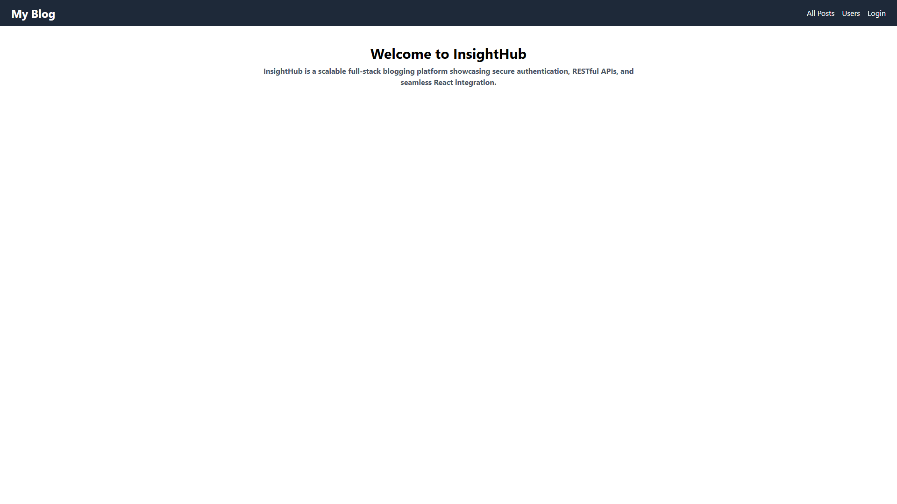
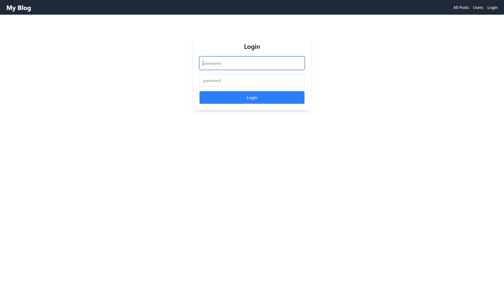
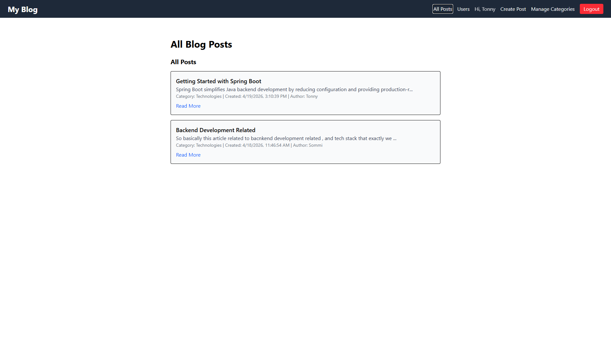

# 📝 InsightHub – Full Stack Blog Platform

## 🌐 Live Demo
- Frontend: https://lucky-cajeta-f40f91.netlify.app  
- Backend API: https://insighthub-api.onrender.com  

---

## 📌 Project Overview

InsightHub is a full-stack blog application designed to demonstrate **CRUD operations, REST API integration, authentication, and role-based ownership logic at the data level (not role-based access control).**

Users can register, log in, create blog posts under categories, comment on posts, and manage their own content. The system enforces ownership-based permissions where only the creator of a post or comment can modify or delete it.

This project was built to showcase **full-stack development skills**, including frontend-backend integration, authentication, and cloud deployment.

---

## 🚀 Features

### 🔐 Authentication
- User registration and login
- JWT-based authentication
- Protected routes for authenticated users only

---

### 📝 Posts
- Create, update, and delete posts (logged-in users)
- View all posts (authenticated users only)
- Only post owner can edit or delete their post
- Image upload support during create/update

---

### 💬 Comments System
- Add comments on posts
- Reply to comments
- Only comment owner can delete their comment
- Nested interaction support

---

### 📂 Categories
- Create, update, delete categories
- Categories cannot be deleted if associated with posts

---

### 👤 User System
- Create user account
- View user information
- Authentication required for most actions

---

## 🧰 Tech Stack

### Frontend
- React (Vite)
- Axios
- React Router

### Backend
- Spring Boot
- Spring Security (JWT)
- REST APIs

### Database
- MySQL (Hosted on Railway)

### Deployment
- Frontend: Netlify
- Backend: Render

---

## 🔐 Authentication Flow

- User logs in → receives JWT token
- Token stored in frontend
- Token sent in request headers
- Backend validates token for protected routes

---


## 📘 API Documentation (Swagger)

Interactive API documentation is available via Swagger UI:

👉 https://insighthub-api.onrender.com/swagger-ui/index.html

You can:
- Explore all endpoints
- Test APIs directly from the browser
- View request/response formats

## 🏗️ Architecture

### System Design (High-Level)

    ┌──────────────────────────┐
    │   React Frontend         │
    │   (Netlify)              │
    └──────────┬───────────────┘
               │ REST API (JWT Auth)
               ▼
    ┌──────────────────────────┐
    │  Spring Boot Backend     │
    │  (Render)                │
    └──────────┬───────────────┘
               │ JDBC
               ▼
    ┌──────────────────────────┐
    │   MySQL Database         │
    │   (Railway)              │
    └──────────────────────────┘

---

### 🔐 Detailed Architecture Flow


User
│
▼
React App (Netlify)
│
│ 1. Login / Register Request
▼
Spring Boot API (Render)
│
│ 2. JWT Authentication Filter
│ 3. Business Logic Layer
│
▼
Service Layer
│
▼
Repository Layer (JPA)
│
▼
MySQL Database (Railway)

Response flows back → React UI updates dynamically


---

## 📸 Screenshots

### 🏠 Home Page


---

### 🔐 Login Page


---

### 📝 Dashboard


---

## 📦 Setup Instructions (Local)

### Backend
```bash
git clone https://github.com/arti-ch278/insighthub-api
cd backend
mvn clean install
mvn spring-boot:run

Frontend
cd frontend
npm install
npm run dev


## 🌍 Environment Variables

### Backend (Render)

```env
DB_URL=your_database_url
DB_USERNAME=your_username
DB_PASSWORD=your_password
JWT_SECRET=your_secret_key
CORS_ORIGIN=your_frontend_url
UPLOAD_DIR=uploads/posts

## 🧠 Key Learnings

- Built full-stack CRUD application
- Implemented JWT authentication
- Managed CORS for cross-origin deployment
- Integrated frontend with REST APIs
- Deployed scalable applications using Netlify & Render

👨‍💻 Author
Developed by: ARTI CHOUREY
Project Type: Full Stack CRUD Application
Purpose: Portfolio / Skill Demonstration
⭐ Key Highlights
Full-stack architecture (React + Spring Boot)
JWT authentication system
Ownership-based authorization logic
REST API integration
Cloud deployment (Netlify + Render + Railway)

---

# 📊 Architecture Diagram (Professional Version)

Here is your **clean production-level architecture diagram**:

                ┌────────────────────────────┐
                │        USERS               │
                └────────────┬───────────────┘
                             │
                             ▼
    ┌─────────────────────────────────────────────
    │          REACT FRONTEND (NETLIFY)          │
    │  - UI Rendering                            │
    │  - Axios API Calls                         │
    │  - JWT Storage                             │
    └───────────────┬────────────────────────────┘
                    │ HTTPS REST API (JWT)
                    ▼
    ┌────────────────────────────────────────────┐
    │        SPRING BOOT BACKEND (RENDER)        │
    │                                            │
    │  Controllers (REST APIs)                   │
    │  Security Layer (JWT Filter)               │
    │  Service Layer (Business Logic)            │
    │  Repository Layer (JPA/Hibernate)          │
    └───────────────┬────────────────────────────┘
                    │ JDBC
                    ▼
    ┌────────────────────────────────────────────┐
    │         MYSQL DATABASE (RAILWAY)           │
    │   - Users Table                            │
    │   - Posts Table                            │
    │   - Comments Table                         │
    │   - Categories Table                       │
    └────────────────────────────────────────────┘